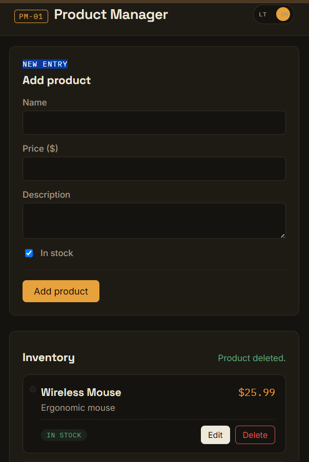
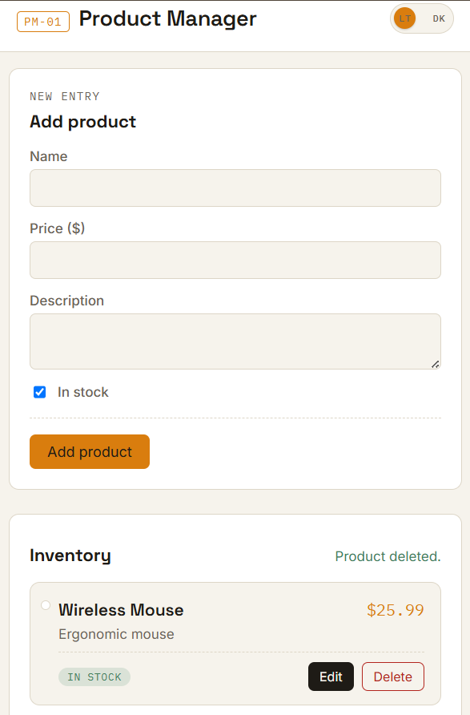
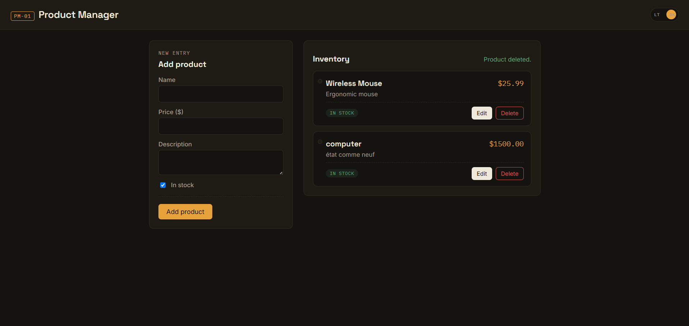

# Product Manager — Full-Stack Application

A full-stack inventory management app, built progressively across the **Codveda Full-Stack Development Internship** (Levels 1–3). Started as a vanilla JS + Express + MongoDB CRUD app, then rebuilt with a React frontend, JWT authentication with role-based access control, model relationships with indexing, and real-time updates via Socket.io.

> ✅ Level 1 complete · ✅ Level 2 complete (Tasks 1–3: React frontend, JWT auth, DB relationships/indexing) · 🚧 Level 3 in progress — WebSockets (Task 2) implemented and verified; GraphQL (Task 3) and Deployment (Task 1) not yet started.
>
> Level 3's tasks are being built out of the document's listed order — WebSockets and GraphQL first, deployment last — so the *final*, feature-complete app gets deployed once, rather than redeployed after every subsequent feature.

## Architecture

```
Two frontends exist in this repo, serving different purposes:

  client/    → React (Vite) — the ACTIVE, maintained frontend
  frontend/  → original vanilla JS/HTML/CSS — Level 1 reference,
               kept in place but no longer developed further

Both talk to the same Express + MongoDB backend, plus a
Socket.io layer for real-time features (client/ only).
```

## Features

**Core (Level 1)**
- Full CRUD on a `Product` resource, RESTful routes, centralized error handling, meaningful HTTP status codes

**React Frontend (Level 2, Task 1)**
- Component-based architecture (Navbar, ProductList, ProductCard, AddProductForm, LoadingSpinner)
- `useState`/`useEffect` data fetching with loading, error, and empty states
- Light/dark theme, persisted across sessions
- Confirmation dialog before destructive actions

**Authentication & Authorization (Level 2, Task 2)**
- Signup/login with bcrypt password hashing and JWT issuance
- Role-based access (`admin` / `user`) enforced server-side via middleware — verified independent of the client by deliberately tampering with a stored role and confirming the server still blocks the elevated action with a 403
- `AuthContext` (React Context API) manages auth state app-wide with `localStorage` persistence
- Write actions (create/update/delete) gated to admins only; read access stays public

**Database Relationships & Optimization (Level 2, Task 3)**
- Products reference their creator via `createdBy` (`ObjectId` + `ref: 'User'`), populated on read with `.populate('createdBy', 'name email role')`
- `createdBy` always set server-side from the authenticated user — never trusted from the request body
- Index on `createdBy`, confirmed with `.explain()` showing `IXSCAN` instead of a full collection scan

**Real-Time Updates (Level 3, Task 2)**
- Socket.io attached to the same HTTP server as Express; JWT verified once at the connection handshake
- Live product sync: create/update/delete broadcast instantly to every connected client, no refresh needed
- Admin-only, room-targeted low-stock alerts, firing only on a genuine `inStock: true → false` transition
- `SocketContext` ties the connection's lifecycle directly to login/logout

## Tech Stack

**Backend:** Node.js, Express.js, Mongoose, MongoDB Atlas, JWT (`jsonwebtoken`), bcrypt, Socket.io, dotenv, cors

**Frontend — active (`client/`):** React 18 (Vite), React Context API, Socket.io-client, vanilla CSS (custom properties, no framework/preprocessor)

**Frontend — legacy reference (`frontend/`):** HTML5, CSS3, vanilla JavaScript (ES Modules, Fetch API) — Level 1 only, superseded by `client/`

**Tooling:** Postman, MongoDB Compass, Git/GitHub

## Screenshots

*Below are the original Level 1 vanilla JS frontend. Updated screenshots of the React app are a pending nice-to-have.*





## Project Structure

```
LEVEL-1/
├── backend/
│   ├── src/
│   │   ├── config/
│   │   │   └── db.js
│   │   ├── controllers/
│   │   │   ├── product.controller.js
│   │   │   └── auth.controller.js
│   │   ├── middlewares/
│   │   │   ├── errorHandler.js
│   │   │   ├── validateObjectId.js
│   │   │   └── auth.middleware.js       # protect, adminOnly
│   │   ├── models/
│   │   │   ├── product.model.js
│   │   │   └── user.model.js
│   │   ├── routes/
│   │   │   ├── product.routes.js
│   │   │   └── auth.routes.js
│   │   ├── socket/
│   │   │   └── socket.js                # Socket.io setup + JWT handshake
│   │   ├── utils/
│   │   │   ├── ApiError.js
│   │   │   └── AsyncHandler.js
│   │   └── app.js
│   ├── server.js                        # shared HTTP server for Express + Socket.io
│   ├── .env.example
│   └── package.json
│
├── client/                              # ACTIVE React frontend
│   ├── src/
│   │   ├── context/
│   │   │   ├── AuthContext.jsx
│   │   │   └── SocketContext.jsx
│   │   ├── components/
│   │   │   ├── Navbar.jsx
│   │   │   ├── ProductList.jsx
│   │   │   ├── ProductCard.jsx
│   │   │   ├── AddProductForm.jsx
│   │   │   ├── LoadingSpinner.jsx
│   │   │   ├── AuthForms.jsx
│   │   │   ├── LoginForm.jsx
│   │   │   ├── SignupForm.jsx
│   │   │   └── LowStockAlert.jsx
│   │   ├── utils/
│   │   │   └── authHeaders.js
│   │   ├── App.jsx
│   │   ├── main.jsx
│   │   └── index.css
│   ├── vite.config.js
│   ├── .env.example
│   └── package.json
│
├── frontend/                            # legacy Level 1 reference — not maintained
│   ├── css/style.css
│   ├── js/{api,main,theme}.js
│   └── index.html
│
├── .gitignore
└── README.md
```

## Getting Started

### Prerequisites
- Node.js (v18+) and npm
- A MongoDB Atlas account (free tier is enough)

### Backend Setup

```bash
cd backend
npm install
```

Create `backend/.env` based on `.env.example`:

```
PORT=5000
MONGO_URI=your_mongodb_connection_string_here
JWT_SECRET=a_long_random_string
JWT_EXPIRES_IN=7d
```

Run it:
```bash
npm start
```
API runs at `http://localhost:5000`.

### React Client Setup (`client/`)

```bash
cd client
npm install
```

Create `client/.env` based on `.env.example`:
```
VITE_SOCKET_URL=http://localhost:5000
```

Run it:
```bash
npm run dev
```
App runs at `http://localhost:5173`. API calls (`/api/...`) are forwarded to the backend via Vite's dev proxy; the Socket.io connection points directly at `VITE_SOCKET_URL`.

### Legacy Vanilla Frontend (`frontend/`) — optional

```bash
cd frontend
npx serve .
```
Kept for reference only; not connected to auth or real-time features.

### Running Everything

For the full current experience: run the backend (port 5000) and the React client (port 5173) simultaneously, in two terminals.

## API Reference

### Auth

| Method | Endpoint | Access | Body |
|---|---|---|---|
| POST | `/api/auth/signup` | Public | `{ name, email, password }` |
| POST | `/api/auth/login` | Public | `{ email, password }` |
| GET | `/api/auth/me` | Protected | — |

Protected routes require `Authorization: Bearer <token>`.

### Products

| Method | Endpoint | Access | Body |
|---|---|---|---|
| GET | `/api/products` | Public | — |
| GET | `/api/products/:id` | Public | — |
| POST | `/api/products` | Admin only | `{ name, price, description?, inStock? }` |
| PUT/PATCH | `/api/products/:id` | Admin only | any subset of the fields above |
| DELETE | `/api/products/:id` | Admin only | — |

`GET` responses include `createdBy` populated with `{ name, email, role }` when the product has a recorded creator. `createdBy` is always set server-side from the authenticated user on create — never accepted from the request body.

### WebSocket Events (Socket.io)

Client connects with a token: `io(VITE_SOCKET_URL, { auth: { token } })`. The server verifies it once at the handshake and rejects the connection if the token is missing, invalid, expired, or belongs to a deleted account.

| Event | Direction | Audience | Payload |
|---|---|---|---|
| `productCreated` | server → client | all connected clients | created product |
| `productUpdated` | server → client | all connected clients | updated product |
| `productDeleted` | server → client | all connected clients | deleted product's `_id` |
| `lowStockAlert` | server → client | `admins` room only | `{ productId, name }` |

All four events originate only from the already admin-gated REST write routes — the real-time layer inherits the same authorization boundary as the REST API, nothing separate to secure.

## Testing

- All REST endpoints manually tested in Postman: success cases, validation failures, and not-found cases per route
- Auth specifically tested against: malformed `Authorization` headers, tampered tokens, expired tokens, and a deliberate client-side role-tampering attempt (confirmed the server still enforces the real role from the database, not the client's claim)
- Real-time features tested across multiple browser tabs/windows: independent per-tab connections, automatic reconnection after the server restarts, and confirmed event listeners don't stack across repeated login/logout cycles

## What I Learned

- Diagnosed and fixed a Windows-specific MongoDB Atlas connection failure (SRV DNS resolution) by forcing Node to use public DNS servers
- Practiced atomic, single-purpose git commits rather than batching unrelated changes together
- Built a centralized Express error handler distinguishing validation errors, cast errors, and generic failures
- The shift from imperative DOM manipulation (Level 1) to React's declarative, state-driven rendering model
- JWT + bcrypt as a stateless auth model, and confirmed hands-on that authorization is only real if it's enforced server-side — a tampered client-side role claim should never be trusted, and testing that directly (rather than assuming it) is what proves it
- Mongoose references (`ref` + `populate`) as the NoSQL analogue to a SQL join, and using `.explain()` to confirm an index is actually being used rather than assuming it
- Socket.io's event model (`emit`/`on`, broadcast vs. room-targeted), and why a `useEffect` cleanup function is load-bearing, not optional, once a component can mount/unmount or re-subscribe repeatedly
- Debugging module system mismatches (CommonJS vs. ES Modules) when new tooling assumptions collide with an existing codebase convention — and that reverting to the established convention is sometimes the more disciplined call than migrating everything

## Roadmap

- GraphQL API layer (Level 3, Task 3)
- Deployment — frontend and backend (Level 3, Task 1 — deliberately last)
- Pagination, filtering, and search on the product list
- Automated tests (Jest + Supertest for the API; React Testing Library for the frontend)
- Rate limiting on auth endpoints to slow brute-force login attempts
- Cross-tab auth state sync (currently requires a refresh to reflect a login/logout that happened in another tab)

## License

MIT